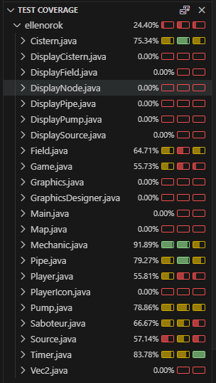

# Ellenőrzési technikák dokumentáció
## Unit tesztelés
### Alap funkciók Unit tesztje
- Négy teszt osztályt készítettem, a projekt alapvető funkcionalitásának a tesztelésére, valamint egy-két összetettebb tesztet is írtam, az olyan funkciókra, amelyek így létezhetnek csak a játék során.
1. A GameTest azt a két esetet teszteli, mikor valamelyik csapat pontot kap.
2. A PipeTest a csőhöz tartozó olyan funkciókat teszteli, amelyeket nem közvetlenül a játékos egy lépésében idéz elő.
3. A PlayerTest azokat az eseteket teszteli, amit egy játékos egy lépésben el tud végezni, vagy két játékos több lépésben, de közvetlen inputtal.
4. A PumpTest a pumpához tartozó, de nem a játékosok által közvetlen előidézett esetek teszteléséért felelős.
- A tesztesetekhez, mivel tesztosztályonként azonosak nagyrészben a változók, ezért BeforeEach-et használtam, amivel minden teszt előtt újra inicializáltam a játékteret, hogy azok egymástól szeparáltan futhassanak.
- A Game statikus változó lépésszámát minden teszt előtt vissza kellett állítani kezdőértékre, mivel ez az újra inicializáláskor a statikusság miatt nem történt meg.

### Code Coverage
- Első körön a teszteket Happy Path tesztekre írtam, mivel ezzel jól tesztelhető a kód nagy része.

- A képen jól látható, hogy ezen tesztesetek a BLL-t tartalmazó osztályok jórészét lefedik.
- A hiányosságot BLL beli osztályok esetén a Getterek és Setterek tesztelésének hiánya, valamint az absztrakt függvények üres implementációinak tesztelésének hiánya okozza.
- A grafikus osztályokat nem teszteltem.